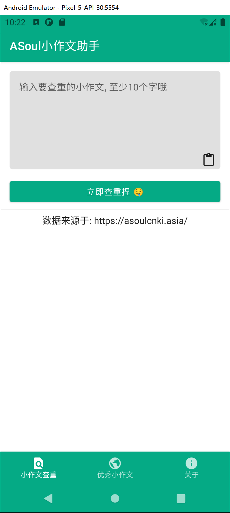
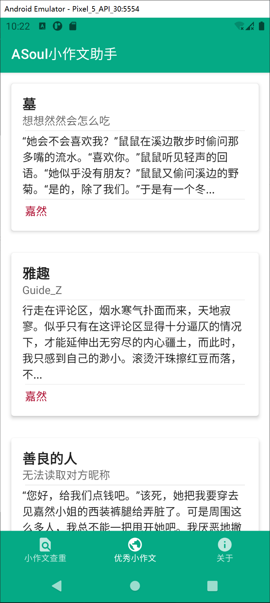
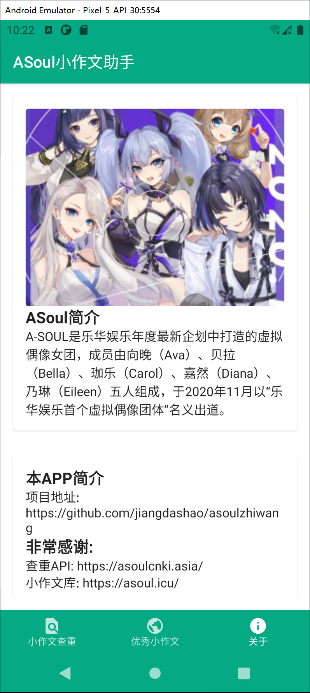

# ASoulZhiWang
基于 https://github.com/stream2000/ASoulCnki 提供的API的枝网安卓查重APP

## A-SOUL简介 🥵
A-SOUL是乐华娱乐于2020年11月23日公开的其旗下首个虚拟偶像团体，由5名成员组成。
* A-SOUL主页链接：https://space.bilibili.com/703007996
* 珈乐：https://space.bilibili.com/351609538
* 乃琳：https://space.bilibili.com/672342685
* 贝拉：https://space.bilibili.com/672353429
* 向晚：https://space.bilibili.com/672346917
* 嘉然：https://space.bilibili.com/672328094

在未来学院中，五位性格迥异的少女，为了成为偶像这一共同目标走到一起，并且为之努力奋斗。

## 下载 🐭
前往Release页面下载: https://github.com/jiangdashao/ASoulZhiWang/releases

## 技术栈和引用库 👍
* JetPack Compose - 声明式UI框架
* Hilt - 依赖注入
* Navigation - 导航
* Retrofit - 访问Restful API
* Paging3 - 列表数据加载库

## 截图 🎞
| 查重 | 小作文库 | 关于 |
| ----- | ------| ------|
| | |  |

